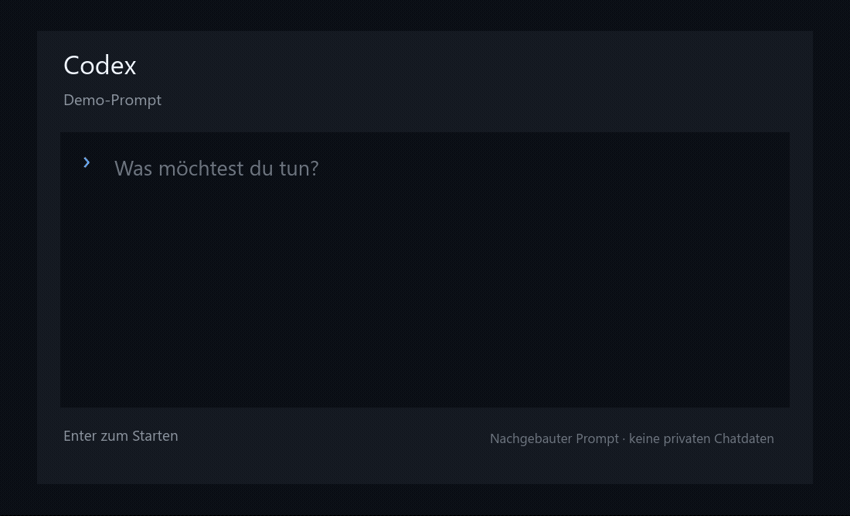

# Inoffizielle API und MCP für SteuerSparErklärung

Steuerfälle mit einem KI-Agenten prüfen, mit Belegen abgleichen und nach
Freigabe kontrolliert bearbeiten – über eine gemeinsame lokale API und einen
optionalen, PC-blinden MCP-Wrapper.

> **Öffentliche Beta für Windows x64.** Vor Änderungen eine Sicherungskopie
> anlegen und Ergebnisse selbst prüfen. Dieses Projekt ist keine
> Steuerberatung und übermittelt nichts an das Finanzamt.

## Was die Beta kann

- einen geöffneten Steuerfall strukturiert lesen und den Programm-Prüfer
  auswerten;
- Angaben mit freigegebenen Belegen und einem Tracking abgleichen;
- fehlende, widersprüchliche oder unklare Angaben als Report zusammenfassen;
- nach ausdrücklicher Freigabe einzelne Korrekturen ausschließlich in einer
  verifizierten Arbeitskopie durchführen und zurücklesen;
- UStVA-Zeiträume für 2025 sowie vorgesehene `GewErfass2026`-Fälle vorbereiten,
  ohne sie zu übermitteln;
- dieselben freigegebenen Funktionen über lokale HTTP-API oder optional MCP
  für Codex, Claude Code und kompatible Agenten bereitstellen.

Die Beta ersetzt weder SteuerSparErklärung noch eine fachliche Prüfung. Sie
automatisiert nachvollziehbare Arbeitsschritte in der installierten Anwendung.

## Voraussetzungen

- Windows x64 und eine installierte SteuerSparErklärung 2025;
- ein **lokal** laufender Agent mit Zugriff auf lokale Dateien und Programme,
  zum Beispiel Codex, die eigenständig angemeldete Claude Code CLI oder
  OpenCode; Claude Cowork ist für dieses host-lokale Setup nicht geeignet;
- für sichtbare Bedienung eine entsperrte, währenddessen unbenutzte
  Windows-Sitzung.

Das portable Release benötigt kein global installiertes Node.js, npm, Python
oder PowerShell 7. Der optionale Weg über `npx skills` und die getrennten
npm-Runtimepakete setzt ein bereits vorhandenes Node.js 22+ mit npm voraus.
Docker und ein Repository-Checkout sind für Nutzer nicht erforderlich. Alle
Voraussetzungen, beide Installationswege, Client-Anbindung und Erfolgskriterien
stehen in der
[Installationsanleitung für Menschen und AI-Agenten](skills/steuer-spar-erklaerung-setup/references/installation.md).
Die native Claude Code CLI unter Windows benötigt zusätzlich Git for Windows
und eine eigene Anmeldung in `claude`; eine Anmeldung in Claude Desktop oder
Cowork ersetzt diese CLI-Anmeldung nicht.

## Schnell mit NPX, ohne MCP

Wenn SteuerSparErklärung, Node.js 22+ und der lokale Agent schon installiert
sind, reicht für einen einzelnen Prüflauf dieser Prompt:

```text
Nutze diese Anleitung:
https://github.com/yadimon/steuer-spar-erklaerung-mcp/blob/main/skills/steuer-spar-erklaerung/SKILL.md

Starte die lokale API über npx. Kein MCP und keine globale Runtime-Installation.
Prüfe meine Einkommensteuererklärung 2025.
Steuerfall: <ABSOLUTER_PFAD_ZUR_ESt2025-DATEI>
Belege: <ABSOLUTE_BELEGORDNER_ODER_KEINE_BELEGE>
Standard-Prüflauf ausführen.
```

`Standard-Prüflauf ausführen` bestätigt dabei zugleich, dass die genannten
Belegpfade vollständig sind.

Der Agent startet `@yadimon/steuer-spar-erklaerung-api@beta` im Vordergrund,
bindet den bestätigten Fallordner nur an diesen Prozess und verwendet die
enthaltene CLI mit derselben gepinnten Paketmarke. Beim ersten Lauf entstehen
eine token-geschützte Konfiguration und private Arbeitsordner im lokalen
Benutzerprofil, aber keine globale Paketinstallation
und kein dauerhafter Startpfad in den NPX-Cache.
Nach dem Report beendet der Agent die API wieder.
MCP und ein Agenten-Neustart sind für diesen Weg nicht nötig.

Läuft bereits eine dauerhaft installierte API auf demselben Loopback-Port,
muss sie zuerst beendet werden; der npx-Start meldet den belegten Port dann
ausdrücklich und arbeitet nicht still über die andere Instanz weiter. Soll aus
diesem Kurzweg später ein dauerhaftes Setup werden, zuerst die npx-API mit
Strg+C beenden und danach das Setup ausführen.

## Schnellstart mit zwei Prompts

### 1. Lokal installieren

Gib einem **lokalen** Agenten diesen Auftrag. Er wählt selbst npm oder das
Portable-Release und richtet beide Skills, API und MCP ein:

```text
Richte SteuerSparErklärung vollständig lokal nach
https://github.com/yadimon/steuer-spar-erklaerung-mcp/blob/main/skills/steuer-spar-erklaerung-setup/references/installation.md
ein. Installiere oder aktualisiere beide Skills und verwende das neueste
vollständige Release.
Standard-Setup ausführen: lokale API plus MCP.
```

`Standard-Setup ausführen` bestätigt den eng begrenzten sicheren Plan der
verlinkten Anleitung einschließlich Download, persistenter Installation und
des bedingten tokenfreien additiven MCP-Merges. Der Agent zeigt Plan und Diff
weiterhin an, fragt innerhalb dieser Grenzen aber nicht erneut. Das Setup
verändert keinen Steuerfall.

Nach einer neuen oder geänderten Skill-/MCP-Installation endet der erste Lauf
mit grünem `--check` und dem Status, dass die Client-Verifikation nach einem
Neustart noch offen ist. Starte den lokalen Agenten dann einmal neu und verwende
Prompt 2. Der neu geladene Agent prüft Serverliste und das echte MCP-Tool
`sse_health` mit `ok=true`, bevor er den Steuerfall bearbeitet. So bleiben es
zwei Prompts; „connected“ oder ein Handshake allein gelten nicht als Nachweis.
Für Codex begrenzt die Installationsanleitung den Modellkatalog auf die
Kernwerkzeuge des Standard-Prüflaufs; alle 87 Operationen bleiben über die
lokale API-CLI verfügbar. Das verhindert, dass aktuelle Codex-Versionen den
großen unbeschränkten MCP-Katalog vollständig ausblenden.

### 2. Steuerfall prüfen

Danach genügt ein fachlicher Prompt mit den echten Pfaden:

```text
Nutze $steuer-spar-erklaerung und prüfe meine Einkommensteuererklärung 2025.
Steuerfall: <ABSOLUTER_PFAD_ZUR_ESt2025-DATEI>
Belege: <ABSOLUTE_BELEGORDNER>
Standard-Prüflauf ausführen.
```

`Standard-Prüflauf ausführen` steht im Skill bereits für die
hashverifizierte Prüffallkopie, sichtbare rein lesende Navigation, den Report
und den Stopp ohne Speichern oder ELSTER. Diese Sicherheitsdetails müssen nicht
in jedem Prompt wiederholt werden.

Eine im Kalenderjahr 2026 abgegebene Einkommensteuererklärung ist hier der
unterstützte Steuerfall **2025**. Das Produktprofil 2026 ist nicht freigegeben.
Vor sichtbarer Navigation erzeugt der Hauptskill eine neue, per SHA-256
verifizierte Prüffallkopie und öffnet nur diese; der Originalfall bleibt
ungeöffnet und unverändert.

### Skills manuell mit `npx` installieren

Die offene [`skills`-CLI](https://www.skills.sh/docs/cli) erkennt beide
[Repository-Skills](skills/). Ersetze `<agent>` durch `codex`, `claude-code`
oder `opencode`:

```powershell
npx.cmd -y skills add yadimon/steuer-spar-erklaerung-mcp --list
npx.cmd -y skills add yadimon/steuer-spar-erklaerung-mcp `
  --skill steuer-spar-erklaerung --skill steuer-spar-erklaerung-setup `
  --agent <agent> --global --copy --yes
```

Die vollständigen nichtinteraktiven Varianten bleiben explizit dokumentiert:

```powershell
npx.cmd -y skills add yadimon/steuer-spar-erklaerung-mcp --skill steuer-spar-erklaerung --skill steuer-spar-erklaerung-setup --agent codex --global --copy --yes
npx.cmd -y skills add yadimon/steuer-spar-erklaerung-mcp --skill steuer-spar-erklaerung --skill steuer-spar-erklaerung-setup --agent claude-code --global --copy --yes
npx.cmd -y skills add yadimon/steuer-spar-erklaerung-mcp --skill steuer-spar-erklaerung --skill steuer-spar-erklaerung-setup --agent opencode --global --copy --yes
```

OpenCode bleibt ein sekundärer, best-effort Client. Mit bereits vorhandenem
Node.js/npm ist sein kurzer Runtime-Weg nach der Skill-Installation:

```powershell
npm.cmd install --global @yadimon/steuer-spar-erklaerung-api@beta @yadimon/steuer-spar-erklaerung-mcp@beta
steuer-spar-erklaerung-setup --defaults --with-mcp
```

Den interaktiven Wizard dort nicht per `stdin` automatisieren. Für den
empfohlenen Standardweg sind Codex oder die eigenständig angemeldete Claude
Code CLI die belastbarer geprüften Clients. Cowork ist wegen seiner isolierten
Ausführungsumgebung kein Host-Installer für lokale API und MCP.

Eine nur geöffnete oder gecachte Webansicht ist keine lokale Skill-
Installation; nach dem Kopieren den Agenten neu laden und beide Skills
auflisten.

`npx skills` installiert nur die geprüften Agentenanweisungen. Ist Node.js 22+
mit npm bereits vorhanden, installiert der Setup-Skill API und MCP persistent.
Sonst führt er durch Download, Prüfsumme und Einrichtung des portablen Releases.

### Runtime mit npm (optional)

Die npm-Pakete sind getrennt: API, Setup und CLI bleiben im Windows-Paket;
der PC-blinde MCP-Wrapper kann unabhängig installiert werden. Das empfohlene
lokale Agenten-Setup installiert beide Pakete in exakt derselben Version:

```powershell
npm.cmd install --global @yadimon/steuer-spar-erklaerung-api@beta @yadimon/steuer-spar-erklaerung-mcp@beta
steuer-spar-erklaerung-setup --with-mcp
steuer-spar-erklaerung-setup --check
```

Die eigenständig angemeldete Claude Code CLI erhält einen eigenen dauerhaften
Präfix direkt unter `%USERPROFILE%\.steuer-spar-erklaerung`; Setup und
`--check` verwenden dort zusätzlich denselben absoluten `--config`-Pfad. Die
kanonische
[Installationsanleitung](skills/steuer-spar-erklaerung-setup/references/installation.md)
enthält die kopierbaren PowerShell-Befehle. Pfade unter
`AppData\Local\Packages\Claude_*\LocalCache` sind kein clientübergreifend
belastbarer MCP-Setup-Erfolg und dürfen nicht aus Cowork oder der Desktop-App
als Host-Installation übernommen werden.

Für einen bewusst später ergänzten MCP-Transport ist auch
`npm.cmd install --global @yadimon/steuer-spar-erklaerung-mcp@beta` zulässig; vor
dem erneuten Setup muss seine Version exakt zum API-Paket passen.

Das persistente Setup nie direkt aus `npx` starten: Der temporäre `_npx`-Cache
ist kein stabiler Ort für dauerhafte API-/MCP-Startpfade. Der oben beschriebene
Foreground-NPX-Start ist davon getrennt: Er schreibt keinen Launcher und endet
mit dem Terminalprozess. Für Nutzer ohne Node/npm ist der Portable-Weg unten
vollständig gleichwertig.

Die Windows-Beispiele verwenden bewusst `npm.cmd` und `npx.cmd`. Damit bleibt
eine frische PowerShell-Execution-Policy unverändert, auch wenn sie die parallel
installierten Shim-Dateien `npm.ps1` oder `npx.ps1` blockiert.

## Beispiel



## Typische Aufgaben

| Ziel | Auftrag an den Agenten | Standard |
| --- | --- | --- |
| Steuerfall prüfen | „Prüfe den geöffneten Fall und liste Fehler, Warnungen und unklare Angaben.“ | Nur lesen |
| Belege abgleichen | „Vergleiche den Fall mit den Belegen in diesem Ordner.“ | Originale unverändert lassen |
| Korrektur vorbereiten | „Schlage Korrekturen vor und ändere nach meiner Freigabe eine Arbeitskopie.“ | Vorher/nachher zurücklesen |
| UStVA vorbereiten | „Bereite die UStVA für Juli vor und sende sie nicht ab.“ | Zeitraum und vorhandene Übermittlungen zuerst prüfen |
| Nur API einrichten | „Richte nur die lokale API ein und verwende empfohlene Antworten.“ | npm oder Portable; kein MCP-Merge |
| Vollständiges Agenten-Setup | „Richte lokale API plus MCP vollständig ein.“ | npm oder Portable; tokenfreier additiver MCP-Merge |

Die Automation unterscheidet drei Betriebsarten:

1. strukturierte UIA-Lesewege ohne Vordergrundwechsel;
2. wenige ausdrücklich profilierte Focusless-Transaktionen mit Feld-, Summen-
   und Dirty-State-Readback;
3. sichtbare Vordergrund-Leases für Controls, die Qt nicht sicher im
   Hintergrund bedienbar macht.

Für sichtbare Bedienung muss Windows entsperrt bleiben. Während der Agent
klickt oder schreibt, nicht gleichzeitig Maus oder Tastatur verwenden. Der
Worker gibt das zuvor aktive Fenster und den Mauszeiger best effort zurück,
sofern keine fremde Eingabe erkannt wurde. Die Sicherheits-Telemetrie bleibt
im vollständigen API-Ergebnis und bei den gemeinsamen API-Werkzeugen im
kanonischen MCP-Strukturergebnis erhalten.
Bei einem vom Profil abweichenden Minor-/Patch-Build bleiben Lesen, Diagnose
und sicherer Cleanup erreichbar. Die in
`capabilities.operationPolicy[*].blockedOnBuildDrift` ausgewiesenen
UI-/Steuerfallmutationen stoppen serverseitig mit `build-drift`, bis der neue
Build live verifiziert wurde.
`capabilities.liveEvidence.operationStatus` trennt zusätzlich je Operation
den releasegebundenen Live-Nachweis von bloßer Offline-Abdeckung. Diese Matrix
ist informativ (`affectsAvailability=false`); nur `operationPolicy` entscheidet
über die tatsächliche Laufzeitfreigabe. Reine API-Clients erhalten denselben
Snapshot auch über die authentifizierte Operations-Discovery.

## Was enthalten ist

- eine lokale, token-geschützte HTTP-API als Kern;
- ein optionaler MCP-Wrapper, der ausschließlich die API aufruft;
- ein portables Windows-x64-Paket mit eigener Node-Laufzeit;
- lokale PDF-zu-PNG- und Bild-OCR-Helfer ohne Python-/Poppler-Pflicht;
- getrennte npm-Pakete für Windows-API und PC-blinden MCP-Wrapper;
- ein deutscher Setup-Skill mit geführtem First-Run und fensterlosem API-Start;
- öffentliche Skills für Prüfung und Einrichtung sowie technische
  Konfigurationshelfer im API-Paket;
- versionierte Produktprofile und gemeinsame API-/MCP-Vertragstests.

| Profil | Status | Aktuell belegter Umfang |
| --- | --- | --- |
| `2025` / Engine 31 | `supported` / `full` | Lesen, Navigation, Ergebnis und Prüfer live geprüft; UStVA-Read für 2025 sowie `GewErfass2026` live geprüft; Schreibpfade nur einzeln freigegeben |
| `2024` / Engine 30 | `experimental` / `verification-only` | derselbe read-only Muster-Sweep nur mit bewusstem Entwickler-Opt-in; keine allgemeine Schreibfreigabe und kein Focusless-Commit |

Der veröffentlichte Beta-Release unterstützt weiterhin Profil `2025`. Der
Quellstand enthält zusätzlich das experimentelle Profil `2024`; der Setup-Skill
bietet es nicht produktiv an. Details und genaue Testgrenzen stehen im
[Verifikationsstand](docs/VERIFIKATION.md). Das Projekt ist unabhängig und
weder mit Wolters Kluwer, Steuertipps noch der Akademischen
Arbeitsgemeinschaft verbunden.

## Einrichtung

### npm-Pakete

`@yadimon/steuer-spar-erklaerung-api@beta` ist der lokale Windows-x64-
API-Wrapper für SteuerSparErklärung. Er enthält HTTP-API, direkte CLI, Profile,
Windows-/Native-Runtime und den technischen Konfigurationshelfer, den der
Setup-Skill verwendet; er enthält keinen MCP-Server.
`@yadimon/steuer-spar-erklaerung-mcp@beta` ist der PC-blinde MCP-Wrapper für
SteuerSparErklärung über dieses API-Paket. Er kennt ausschließlich API-URL und
Token und automatisiert die Oberfläche nicht selbst. Beide Pakete müssen
dieselbe Version tragen und zum vollständigen GitHub-Release gehören.
Die npm-Seiten besitzen eigene Einstiege für das
[API-Paket](packages/api/README.md) und den
[MCP-Wrapper](packages/mcp/README.md); diese erklären Voraussetzungen,
Paketgrenzen und Sicherheitsregeln ohne einen lokalen Repository-Checkout.

### Portables Release

1. Von der [Release-Seite](https://github.com/yadimon/steuer-spar-erklaerung-mcp/releases)
   `steuer-spar-erklaerung.zip` und die zugehörige `.sha256`-Datei laden.
2. SHA-256 prüfen und das ZIP in einen neuen leeren lokalen Ordner entpacken.
   Unter Windows ist `tar.exe` dafür deutlich schneller als `Expand-Archive`;
   einen nach Timeout nur teilweise gefüllten Ordner nicht verwenden.
3. `sse-setup.cmd` starten oder den
   [Setup-Skill](skills/steuer-spar-erklaerung-setup/SKILL.md) verwenden.
4. Die vorgeschlagenen sicheren Standardwerte übernehmen oder Pfade und
   Arbeitsweise einzeln festlegen.

Die Prüfsumme lässt sich im Downloadordner mit Windows PowerShell vergleichen:

```powershell
$actual = (Get-FileHash -Algorithm SHA256 '.\steuer-spar-erklaerung.zip').Hash.ToLowerInvariant()
$expected = ((Get-Content '.\steuer-spar-erklaerung.zip.sha256' -Raw).Trim() -split '\s+')[0].ToLowerInvariant()
if ($actual -ne $expected) { throw 'SHA-256 stimmt nicht. ZIP nicht verwenden.' }
"SHA-256 stimmt: $actual"
```

Nach erfolgreicher Prüfung beispielsweise so entpacken:

```powershell
$target = Join-Path $PWD 'steuer-spar-erklaerung'
if (Test-Path -LiteralPath $target) { throw "Neues Ziel existiert bereits: $target" }
New-Item -ItemType Directory -Path $target | Out-Null
& "$env:SystemRoot\System32\tar.exe" -xf '.\steuer-spar-erklaerung.zip' -C $target
if ($LASTEXITCODE -ne 0) { throw "Entpacken fehlgeschlagen: $LASTEXITCODE" }
```

Der Wizard erkennt eine vorhandene Konfiguration am Standardpfad, erzeugt bei
Bedarf ein lokales Token und legt außerhalb des Repositorys an:

- API-Konfiguration und fensterlosen Starter;
- bei `--with-mcp` eine tokenfreie MCP-Mergevorlage;
- `setup-decisions.json` für maschinenlesbare Entscheidungen;
- `settings.md` für persönliche Prioritäten und Quellen;
- `tracking.md` oder eine Referenz auf eine vorhandene `.xlsx`-Datei;
- getrennte Ordner für Dokumentkopien, Ergebnisse und Backups.

Mit `--defaults` läuft die technische Einrichtung mit sicheren Vorgaben.
Nach den zwei First-run-Bestätigungen kann der Agent die bestätigten absoluten
Fall- und Belegordner über eine kurze private JSON-Datei mit `--plan-file`
übergeben; der Wizard akzeptiert daraus keine Tokens oder Schreibrechte und
stellt keine Eingabeprompts erneut. Eine vorhandene technische Konfiguration
mit leeren Fall-/Quellbindungen darf er damit genau einmal ergänzen; Token,
MCP-Transport und sonstige Einstellungen bleiben erhalten, bereits nicht leere
Bindungen werden abgelehnt. Eine laufende exakt gebundene API beendet und
startet der Wizard dabei selbst kontrolliert neu. `--no-start` erzeugt nur die Dateien. Sonst fragt der Wizard, ob er die API
jetzt fensterlos starten und Health, Discovery sowie Arbeitsbereich prüfen darf.
Die API kann Markdown-Fortschritte als neue datierte Snapshots anlegen, ersetzt
aber keine vorhandene Trackingdatei. Eine referenzierte XLSX-Datei wird nur über
eine separat verfügbare Tabellen-Fähigkeit des Agenten gelesen oder geändert.

### Aus dem Quellcode

Nur Entwicklung und Ausführung direkt aus dem Repository benötigen Node.js 22
oder neuer mit npm:

```powershell
npm ci
npm run build
npm run setup -- --no-start
```

Python und PowerShell 7 sind nicht erforderlich. Die Windows-Automation nutzt
Windows PowerShell 5.1.

## API verwenden

Die API bindet ausschließlich an Loopback (`127.0.0.1` oder `::1`) und verlangt
ein Bearer-Token. Sie beschreibt ihre freigegebenen Operationen selbst:

```powershell
steuer-spar-erklaerung-call health
steuer-spar-erklaerung-call discovery
steuer-spar-erklaerung-call describe workspace_status
steuer-spar-erklaerung-call workspace_status
```

Komplexe Argumente werden bevorzugt über eine begrenzte UTF-8-JSON-Datei
übergeben, damit Token, Pfade und Nutzdaten nicht in der sichtbaren
Prozesskommandozeile erscheinen. Mehrzeilige oder nicht-ASCII Texte gehören
immer in diese Datei; eine Windows-PowerShell-stdin-Pipeline kann Umlaute durch
`?` ersetzen. Für kleine ASCII-Objekte bleibt `--args-file -` verfügbar. Für
eigene Clients stehen zur Verfügung:

- `GET /healthz`
- `GET /v1/operations`
- `GET /v1/operations/{operation}`
- `GET /v1/openapi.json`
- `POST /v1/operations/{operation}`

Beispiel für einen authentifizierten Aufruf ohne Token in der Kommandozeile:

```powershell
steuer-spar-erklaerung-call workspace_status
```

Operationen verwenden logische Ressourcen wie `cases:`, `documents:` und
`results:`. Dadurch müssen API-Clients keine lokalen PC-Pfade kennen.

## MCP als optionale Produktfunktion anbinden

MCP ist ein dünner Wrapper über dieselbe API. Sein Prozess kennt nur URL und
Token; SSE-, Fall- und Dokumentpfade bleiben in der lokalen API-Konfiguration.
Ein reines API-Setup braucht MCP nicht. Der oben dokumentierte vollständige
Agenten-Standard enthält MCP, weil Prompt 1 ausdrücklich „lokale API plus MCP“
beauftragt.
Die vom Setup erzeugte Servervorlage wird nach Prüfung in die Konfiguration des
jeweiligen Clients gemergt:

`command` zeigt direkt auf die portable `runtime/node.exe`. Die Argumente
starten zuerst den lokalen Bootstrap; nur er liest das API-Token aus der
geschützten Konfiguration und reicht es intern an den MCP-Prozess weiter:

```json
{
  "mcpServers": {
    "steuer-spar-erklaerung": {
      "command": "<PORTABLE>/runtime/node.exe",
      "args": [
        "<PORTABLE>/dist/api-mcp-bootstrap.js",
        "--config", "<LOCALAPPDATA>/SteuerSparErklaerungApi/config.json",
        "--mcp-entry", "<PORTABLE>/dist/index.js"
      ]
    }
  }
}
```

Die Client-Konfiguration enthält dadurch weder `SSE_API_TOKEN` noch einen
Bearer-Wert. So werden außerdem Batch-/Shim-Prozesse und unnötige
Konsolenfenster vermieden. Eine vorhandene Client-Konfiguration nie vollständig
ersetzen; nur den bestätigten tokenfreien Servereintrag mergen. Danach
`steuer-spar-erklaerung-setup --check`, die Serverliste des neu geladenen
Clients und einen echten Aufruf des MCP-Tools `sse_health` mit `ok=true`
prüfen. Ein bloßes „connected“ oder ein Handshake genügt nicht.

## Sicherheitsmodell

Die lokale API erzwingt technisch:

- ELSTER-, Versand- und Übermittlungsaktionen sind im Katalog gesperrt.
- Die API ist nur über Loopback und mit lokalem Token erreichbar.
- Schreiboperationen arbeiten mit PID/HWND, erwarteter Seite und
  Vorher-/Nachher-Prüfung.
- Arbeitskopien, Backups und Archive entstehen nur an neuen Zielen: ein
  vorhandenes Ziel wird nie überschrieben, und die Kopie wird byteweise
  zurückgelesen.
- Speichern ist an den erwarteten Pfad und den erwarteten Hash gebunden.
- Mehrdeutige SSE-Fenster brechen ab statt zu raten.
- API-Logs enthalten keine Argumente, Ergebnisse oder Tokens.
- MCP gibt keine lokalen PC-Pfade an den Client weiter.

Der Prüfablauf der Skills garantiert zusätzlich:

- Lesen ist der Standard; Änderungen brauchen eine ausdrückliche Freigabe.
- Der Originalfall wird nicht geöffnet; gearbeitet wird auf einer
  verifizierten Arbeitskopie.
- Eine reine Prüfung endet ohne Speichern.

Diese zweite Liste ist Ablaufdisziplin, keine technische Sperre der API: Die
direkte lokale API kann jede ausdrücklich benannte Datei öffnen und speichern.
Ebenso ist `--case-dir` die Auflösungs- und Schwärzungsgrenze für
`cases:`-Referenzen und keine Zugriffssperre der direkten API.

Die Automation kann fachliche Fehler nicht ausschließen. Vor einer Abgabe sind
Steuerfall, Belege und Programmprüfung selbst zu kontrollieren. Details stehen
in der [Produktarchitektur](docs/ARCHITEKTUR.md) und im
[Betriebsvertrag](skills/steuer-spar-erklaerung/references/betriebsvertrag.md).

## Umsatzsteuer-Voranmeldung

Die UStVA-Werkzeuge wählen Zeitraum und Formularabschnitt über stabile
Fachschlüssel. Sie prüfen vorhandene Übermittlungen, lesen Werte zurück und
speichern oder senden nicht automatisch.

Für `*.GewErfass2026` wird weiterhin die installierte Anwendung für das
Steuerjahr 2025 verwendet, aber der Fall muss mit `mode=einurvor` gestartet
werden. `product_info`/`sse_product_info` nennt die freigegebenen Folgejahre
unter `supportedCaseYears`; die UStVA-Lesung gibt den tatsächlichen Formularjahrgang
separat als `taxYear=2026` zurück.

```text
Bereite meine Umsatzsteuer-Voranmeldung für Juli in einer verifizierten
Arbeitskopie vor. Prüfe zuerst Jahr, Meldezeitraum, vorhandene Übermittlungen
und Belege. Zeige jede Änderung und sende nichts über ELSTER ab.
```

Der vollständige Ablauf ist unter
[Umsatzsteuer-Voranmeldung](docs/UMSATZSTEUER-VORANMELDUNG.md) beschrieben.

## Entwicklung und Tests

```powershell
npm ci
npm run test:fast
npm test
npm run test:live
npm run package:portable
npm run pack
npm run publish:dry-run
npm run test:npm-clean-install
npm run smoke:published
```

Maintainer können sämtliche lokalen Release-Gates mit `npm run check`
zusammenfassen. `npm run release:current` ist absichtlich stärker: Es darf nur
auf einem sauberen, releasefertig versionierten `main` laufen, erstellt und
prüft Tag sowie GitHub-Prerelease, startet anschließend Trusted Publishing und
installiert zum Schluss beide exakten Registry-Pakete für einen realen Smoke.

Jeder Build entfernt ausschließlich veraltete `dist/*.js`- und
`dist/*.js.map`-Dateien ohne passende TypeScript-Quelle. Unbekannte Dateien
oder Links im Buildordner stoppen fail-closed. Die beiden npm-Paketverträge
prüfen zusätzlich, dass kein quellloses Artefakt ausgeliefert wird, die API
keinen MCP-Server enthält und der MCP-Tarball weder PowerShell noch Profile
kennt. `package:portable` öffnet das erzeugte
ZIP vor dem Schreiben der äußeren Prüfsumme erneut: Pfade, Windows-Kollisionen,
Produkt/Version, Dateizahl, Bytezahl und SHA-256 jeder manifestierten Datei
müssen exakt stimmen; Extra-Dateien stoppen den Build.

Der Native-Build verwendet eine vorhandene `sse-native.dll` nur wieder, wenn
striktes Manifest, aktueller C#-Quellhash, tatsächlicher DLL-Hash und die
vollständige erwartete Typ-/Methodenoberfläche gemeinsam passen. Dadurch bleibt
das erneut geprüfte Artefakt bei unveränderter Quelle stabil; Änderung,
Beschädigung oder ein inkompatibles Compilerartefakt erzwingt einen
vollständigen Neubau. Der mit
Windows PowerShell 5.1 verfügbare .NET-Framework-Compiler garantiert für zwei
frische Builds jedoch keine byteidentische DLL. Das Manifest bindet deshalb
immer die konkret ausgelieferten Bytes, nicht ein angenommenes Build-Ergebnis.

`npm test` prüft unter anderem API-/MCP-Verträge, Argumentgrenzen, Backups,
Skills, Links und Repository-Datenschutz, startet aber keine echte SSE-UI. Das
strikte opt-in Live-Gate verwendet ausschließlich herstellereigene
Wegwerfkopien, prüft beide Profile nacheinander und lässt fehlende
Voraussetzungen nicht als grünen SKIP gelten:

```powershell
npm run test:live
```

Private Steuerfälle gehören nicht in das Repository. Welche Operationen nur
ein Schema/Mock, einen echten Leseweg oder eine Mutation belegen, ist in
[Verifikation](docs/VERIFIKATION.md) getrennt aufgeführt.

Beide Läufe schließen mit zwei Laufzeitbilanzen ab: Jede Operation, die
während der Suite einen echten API-Executor erreicht, wird protokolliert und
gegen `test/operation-coverage.json` geprüft. Verschwundene Abdeckung ist eine
Regression, neu entstandene muss bewusst übernommen werden
(`SSE_WRITE_OPERATION_COVERAGE=1`). Parallel hält
`test/operation-result-shape.json` ausschließlich Ergebnisfeldnamen und
wertfreie JSON-Typklassen fest. Bei einem Objektfeld werden zusätzlich dessen
sichere direkte Schlüsselnamen und Typklassen erfasst – niemals Steuerwerte,
Pfade oder tiefer verschachtelte Inhalte. Neue
Felder oder Typvarianten brauchen `SSE_WRITE_OPERATION_SHAPE=1`. Die Bilanzen
sind damit die verbindliche Antwort auf „welche API-Funktion und Ergebnisform
ist wirklich belegt?" – Prosa ist es nicht.

Alle 87 API-Operationen veröffentlichen mindestens ein eigenes fachliches
Ergebnisfeld. Die Schemas bleiben trotzdem vorwärtskompatible
Mindestverträge: Nicht jedes optionale Worker-Feld und nicht jeder UI-Zustand
ist bereits durch einen echten Live-Lauf erzeugt.

Das Live-Gate braucht eine unbenutzte Windows-Sitzung: Navigation läuft über
echte Mausklicks, und Windows verweigert den Vordergrundwechsel, solange
nebenher gearbeitet wird.

Weitere Unterlagen:

- [Abgleichvorlage](docs/ABGLEICH-BEISPIEL.md)
- [Produktarchitektur](docs/ARCHITEKTUR.md)
- [API-/MCP-Vertrag](docs/API-MCP-VERTRAG.md)
- [Verifikationsstand](docs/VERIFIKATION.md)
- [Release-Prozess](docs/RELEASE.md)
- [Release Notes v0.1.0-beta.9](docs/releases/v0.1.0-beta.9.md)
- [Entwicklungswissen](docs/entwicklung/README.md)
- [Mitwirken](CONTRIBUTING.md)
- [Haupt-Skill](skills/steuer-spar-erklaerung/SKILL.md)
- [Setup-Skill](skills/steuer-spar-erklaerung-setup/SKILL.md)

## Feedback und Beiträge

Fehlerberichte und Pull Requests sind willkommen. Niemals echte Steuerfälle,
Belege, Namen, Steuer-IDs, Tokens, lokale Pfade oder ungeschwärzte Screenshots
öffentlich hochladen. Der [Beitragsleitfaden](CONTRIBUTING.md) beschreibt
Entwicklungsumgebung, Tests und Datenschutz; Sicherheitsprobleme gehören in
den privaten GitHub-Bereich **Report a vulnerability**.

## Lizenz

[MIT](LICENSE)
